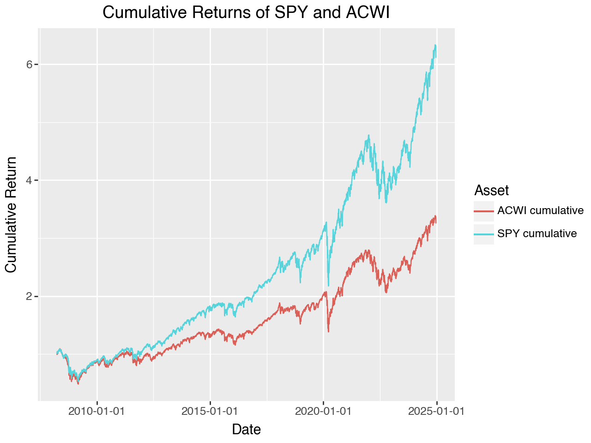

# SPY vs. ACWI Crisis Analysis 📈

This project analyzes the performance of **SPY (S&P 500 ETF)** and **ACWI (MSCI ACWI ETF)** during major financial crises. The study evaluates **cumulative returns** for each crisis period, highlighting market resilience and drawdowns.

## **Overview**
- **Data Sources**: Daily ETF returns for **SPY & ACWI**.
- **Crisis Events**: Six major financial crises (2007–2023).
- **Methodology**:
  - Computes **cumulative returns** for SPY & ACWI.
  - Extracts performance during **specific crisis periods**.
  - Visualizes results through comparative **line charts**.

## **Crisis Periods & Performance**
The following charts illustrate **cumulative returns** for SPY & ACWI during key market downturns.

### 📉 **Global Financial Crisis (2007-2009)**

### 💶 **European Sovereign Debt Crisis (2010-2012)**

### 🇨🇳 **Chinese Stock Market Turmoil (2015-2016)**

### 🦠 **COVID-19 Market Crash (2020)**

### 📉 **Crypto Winter & Tech Stock Correction (2021-2022)**

### ⚡ **Energy & Inflation Crisis (2022-2023)**

## 📊 **Overall Market Performance**
The **cumulative return comparison** of SPY & ACWI over the full dataset:

## **Workflow**
1. **Load ETF returns** for SPY & ACWI.
2. **Filter data by crisis periods**.
3. **Compute cumulative returns** during each crisis.
4. **Generate visualizations** for individual crises & full dataset.

---

This study provides insight into **historical market resilience**, helping investors understand **SPY vs. ACWI performance** under financial stress. 📈📉